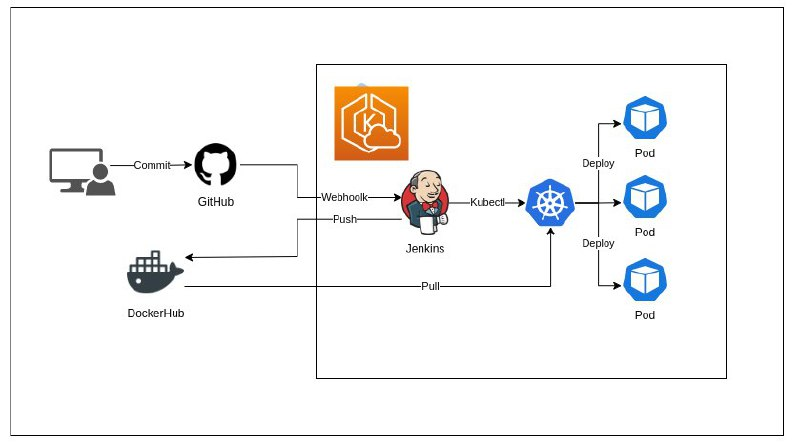
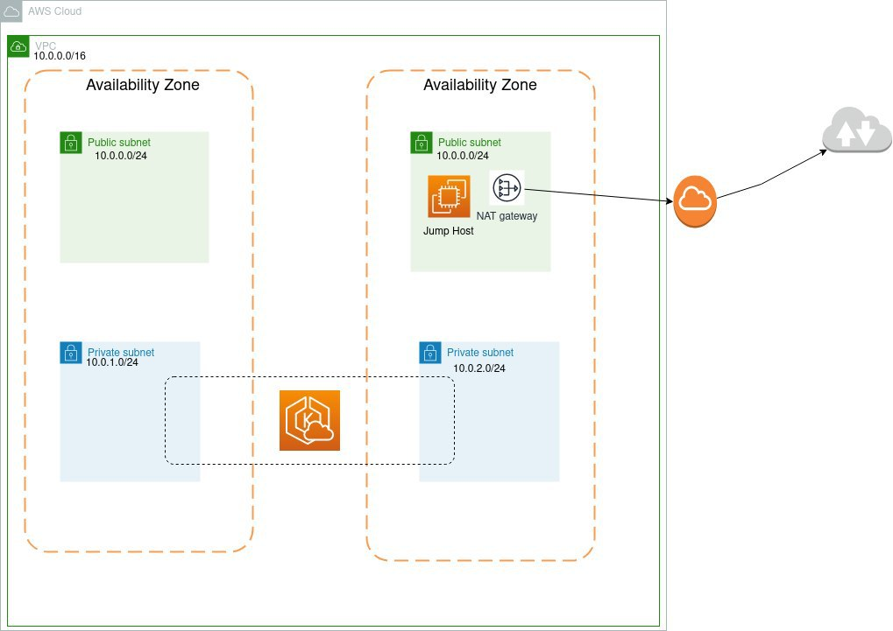
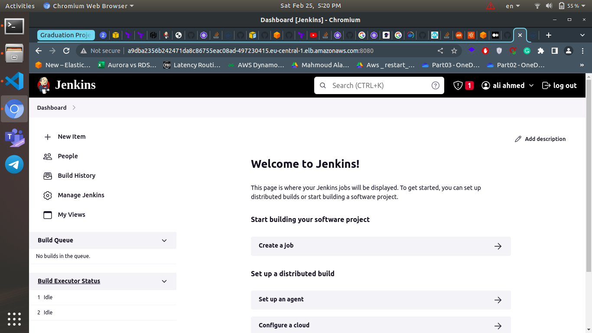
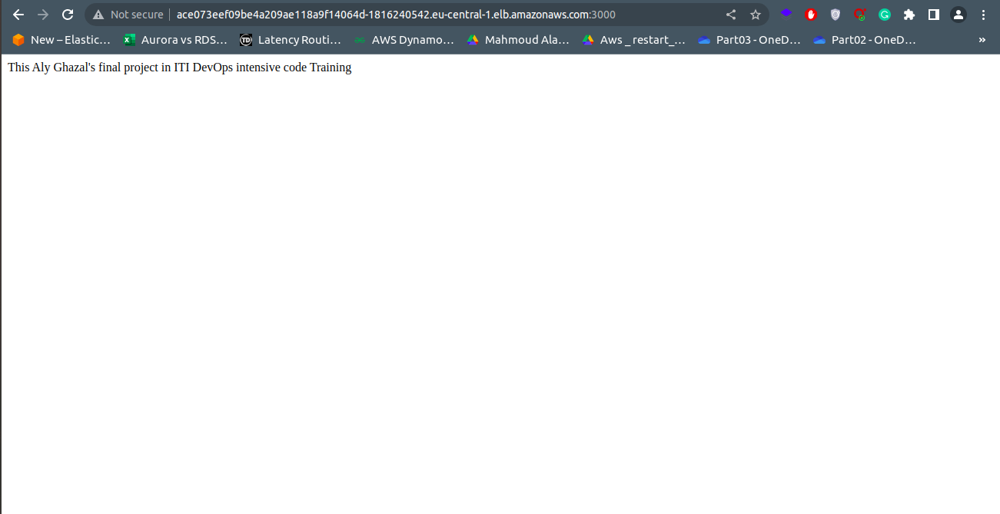

# ITI DevOps Track Graduation Project

The purpose of this project is to Deploy a simple Nodejs app in K8s cluster using Jenkins deployed in the same K8s cluster too

## Our deployment would be look like this



and for This we will use **AWS** Infrastructure to deploy our application using Terraform

## Required Infrastructure



## How to Deploy our app in EKS(Elastic Kubernetes Service) in AWS

1. we will create this infra

   - a VPC
   - at least one public subnet and 2 private subnets
   - Internet Gateway & NAT Gateway
   - one Bastion host
   - one EKS cluster with a Node group

    To deploy this infra we enter those commands in terminal

    ```bash
    cd ./Terraform-Iaac
    terraform init
    terraform apply -auto-aprove
    ```

    **(Note):** in this project we will use Bastion host to install Docker daemon in worker nodes because we EKS latest version "1.24" and it don't have Docker engine like the previous versions

2. Build and push custom jenkins image with Kubectl and docker client to Dockerhub

    ```bash
    cd ./JenkinsInK8s
    docker login
    docker build . -f Dockerfile -t <your-username-in-dockerhub>/jenkins:v1.0
    docker push <your-username-in-dockerhub>/jenkins:v1.0
    ```

3. connect to EKS created cluster

   ```bash
   aws eks --region <region-of-deployed-cluster> update-kubeconfig --name <cluster-name>
   ```

4. install docker engine in worker nodes with Bastion host using ansible

   1. edit ip address and path of the private key of the bastion host and worker nodes in Ansible-files/inventory.ini

   2. edit ip address and path of the private key of bastion host in ~/.ssh/config

   3. apply this playbook with this command

        ```bash
        cd /Ansible-files
        ansible-playbook playbook.yml -i inventory.ini 
        ```

5. deploy our custom jenkins in our EKS cluster

    ```bash
    cd /JenkinsInK8s
    kubectl apply -f .
    kubectl apply -f . #in case the first apply didn't run will
    ```

    then to get url (External IP address) of the exposed jenkins pod we run this command

    ```bash
    kubectl get svc -n jenkins-ns
    ```

    and using this url in our browser the result will be like that

    ***Link:*** <http://a9dba2356b242471da8c86755eac08ad-497230415.eu-central-1.elb.amazonaws.com:8080/>

    **output**

    

6. Add our dockerhub and github credintials in Jenkins agent
7. create pipeline with the provided jenkinsfile which

   - clone app and it's deployment files from [Aly-Ghazal/nodejs-app-deployment-from-jenkins](https://github.com/Aly-Ghazal/nodejs-app-deployment-from-jenkins)
   - build image for it
   - push it to container registery (Dockerhub)
   - apply deployment files using kubectl tool

8. start building pipeline and access console output to get link of the deployed app

    ***Link:*** <http://ace073eef09be4a209ae118a9f14064d-1816240542.eu-central-1.elb.amazonaws.com:3000/>

   **output**

   

## cleanup

1. create new pipeline in jenkins to delete app deployment using jenkinsfile-RemoveAPP
2. then in your local machine in JenkinsInK8s

   ```bash
   cd /JenkinsInK8s
   kubectl delete -f .
   ```

3. in Terraform-Iaac

   ```bash
   cd /Terraform-Iaac
   terraform destroy
   ```

## Future Work

we can use an older version of EKS cluster to use docker engine without the need of install it by bastion host

OR

keep using the same version but instead of using Docker we can use a tool like [Kaniko](https://github.com/GoogleContainerTools/kaniko) to build images for our app it lack some features that docker have like caching built images but it still more secure than using a bastion host to install docker engine
